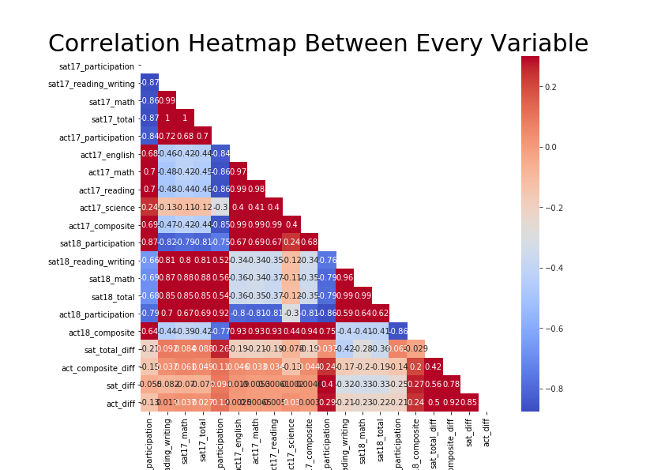
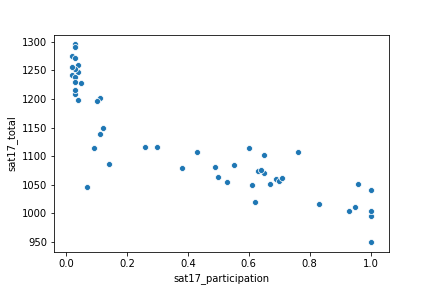
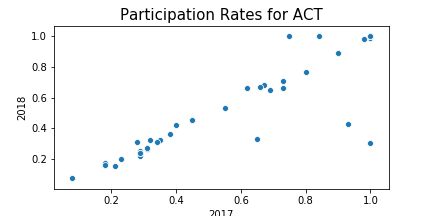
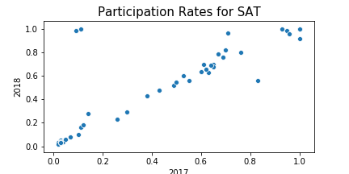

# Project 1 (SAT/ACT) README

## Table of Contents
[1.0 Directory Structure](#1.0-Directory-Structure)<br>
[2.0 Project Outline / Problem Statement](#2.0-Project-Outline-/-Problem-Statement)<br>
[3.0 Description of Data](#3.0-Description-of-Data)<br>
[3.1 Size](#3.1-Size)<br>
[3.2 Source](#3.2-Source)<br>
[3.3 Data Dictionary](#3.3-Data-Dictionary)<br>
[4.0 Data Visualization](#4.0-Data-Visualization)<br>
[5.0 Conclusion](#5.0-Conclusion)<br>
[5.1 Next Steps](#5.1-Next-Steps)<br>
[6.0 Outside Sources](#6.0-Outside-Sources)<br>

## 1.0 Directory Structure

```
.
├── project_1
    ├── code
        ├── ACT_SAT_Test_Differences_US.ipynb.ipynb
    ├── data
        ├── act_2017.csv
        ├── act_2018.csv
        ├── combined_2017.csv
        ├── final.csv
        ├── sat_2017.csv
        ├── sat_2018.csv
    ├── plots
        ├── heat_map.png
        ├── neg_rel.png
        ├── part_rate_act.png
        ├── part_rate_sat.png
    ├── README.md
    └── sat_project.pdf
```

## 2.0 Project Outline / Problem Statement

### **The goal of this project was two fold. One, to utilize python in cleaning, arranging, and merging datasets. The other to use exploratory analysis skills towards locating anomalies and finding trends in the data. Furthermore, to provide plausible explanations that may cause such differences.**

---
## 3.0 Description of Data

### 3.1 Size

* 50 rows, each represent a state
* 17 original columns, 4 more added during analysis

### 3.2 Source

* ACT : https://blog.prepscholar.com/act-scores-by-state-averages-highs-and-lows
* SAT : https://blog.collegevine.com/here-are-the-average-sat-scores-by-state/

### 3.3 Data Dictionary

|Feature|Type|Dataset|Description|
|---|---|---|---|
|state|object|ACT/SAT|List of states in the United States, plus Washington D.C.| 
|sat2017_participation|float|SAT|The participation rate of students within the state who took the SAT exam in 2017.| 
|sat17_reading_writing|integer|SAT|The average Reading/Writing score of the SAT exam within the state in 2017.|
|sat17_math|integer|SAT|The average Math score of the SAT exam within the state in 2017.|
|sat17_total|integer|SAT|The average Total score of the SAT exam within the state in 2017.|
|act17_participation|float|ACT|The participation rate of students within the state who took the ACT exam in 2017.|
|act_2017_english|float|ACT|The average English score of the ACT exam within the state in 2017.| 
|act_2017_math|float|ACT|The average Math score of the ACT exam within the state in 2017.| 
|act_2017_reading|float|ACT|The average Reading score of the ACT exam within the state in 2017.| 
|act_2017_science|float|ACT|The average Science score of the ACT exam within the state in 2017.| 
|act17_composite|float|ACT|The average Composite score of the ACT exam within the state in 2017.|
|sat2018_participation|float|SAT|The participation rate of students within the state who took the SAT exam in 2018.| 
|sat18_reading_writing|integer|SAT|The average Reading/Writing score of the SAT exam within the state in 2018.|
|sat18_math|integer|SAT|The average Math score of the SAT exam within the state in 2018.|
|sat18_total|integer|SAT|The average Total score of the SAT exam within the state in 2018.|
|act18_participation|float|ACT|The participation rate of students within the state who took the ACT exam in 2018.|
|act18_composite|float|ACT|The average Composite score of the ACT exam within the state in 2018.|
|*sat_total_diff|integer|SAT|The absolute value of the difference between SAT Total scores in 2017 and 2018|
|*act_composite_diff|float|ACT|The absolute value of the difference between ACT Composite scores in 2017 and 2018|
|*sat_diff|float|SAT|The absolute value of the difference between SAT Participation Rates in 2017 and 2018|
|*act_diff|float|ACT|The absolute value of the difference between ACT Participation Rates in 2017 and 2018|

** added columns to the original final dataset

---
## 4.0 Data Visualization



<center> Shows the correlation between each variable in the original final dataset (couldn't figure out how to make it bigger)



<center> This plot narrows in on the strong negative relationship, seen on the heatmap above, of the 2017 SAT between participation rate and total score. 



<center> This plot shows that Colorado and Illinois' ACT participation rates decreased the most from 2017 to 2018.



<center> The plot above shows that Colorado and Illinois' SAT participation rates spiked from 2017 to 2018.<center>

---
## 5.0 Conclusion

There were many interesting things we found in this data. We saw large changes in participation, big differences in scores between the years, and telling correlations between our various variables. The most interesting story to be told was around participation of a couple states of both tests from year 2017 to year 2018. The data indicates that Colorado and Illinois SAT participation rates largely increase from 2017 to 2018 but their ACT participation decreases. We also noted that Alaska's ACT participation rate decreases a fair amount as well from 2017 to 2018. After further contextual research, we discover that Colorado and Illinois made the SAT mandatory and free between the years 2017 and 2018, fitting the trend of our data. Resources also tell us that, in the year 2017, Alaska no longer required their high school students to take either the SAT or ACT, confirming the decrease in ACT participation in 2018 we saw in the data. Our data suggests that if you make the test mandatory, and furthermore free then the participation rate will increase. On the other hand, if you take away the requirement of taking a test, students will naturally not take it. 

### 5.1 Next Steps

After sifting and analyzing through this data, I would want to collect more types of data if possible. I think if we had a column that represented if the state required a test would be helpful. What also might be interesting is if we added a gender column. The last piece of data that I'd like to collect would be the price of taking these tests. 

---
## 6.0 Outside Sources

- https://www.chalkbeat.org/posts/co/2015/12/23/goodbye-act-hello-sat-a-significant-change-for-colorado-high-schoolers/
- https://www.testive.com/illinois/
- https://www.adn.com/alaska-news/education/2016/06/30/students-no-longer-need-national-tests-to-graduate/